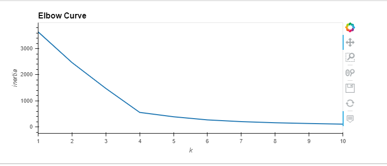
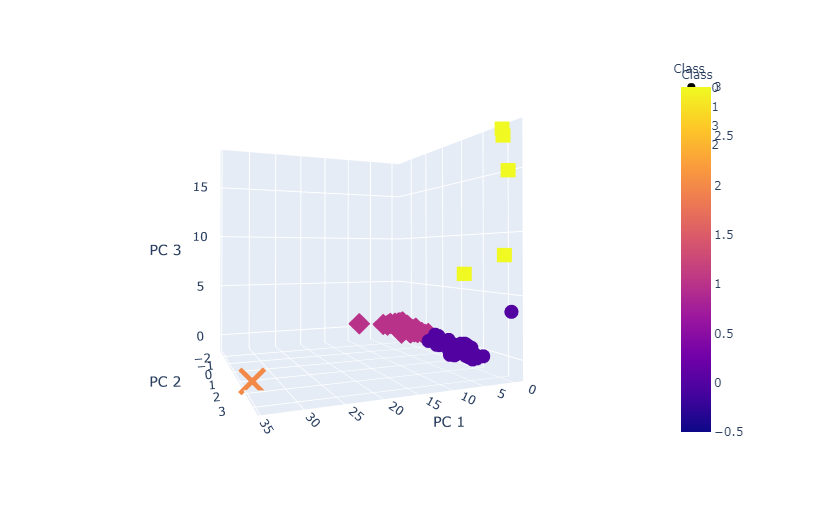
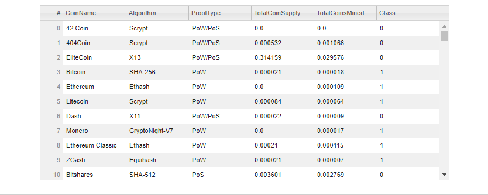
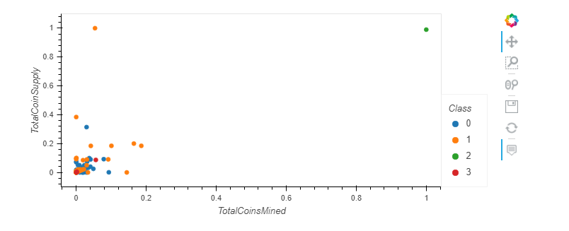

# Cryptocurrencies

## Overview
Our client is asking us to assist with convincing investors to invest in cryptocurrencies.  Our task is to utilize Unsupervised Machine Learning to analyze a dataset of crypto currencies to discover patterns from input data only and try to find clusters in the data using K-means algorithm and then make our model more efficient using principal component analysis (PCA).

Unsupervised learning is used in one of the following two ways:

1. Transform the data to create an intuitive representation for analysis or to use in another machine learning model; or
2. Cluster or determine patterns in a grouping of data, rather than to predict a classification.  

We don't really know how to group the crypto currency data, but we know that grouping the data will likely be informative. 

## Results
Our first step is to clean the data.  In this step we read data in from a .CSV file.  We selected only the cryptocurrencies that are actively traded and have a working algorithm.  Next we dropped all records that have null values.  Last we dropped all crypto currency rows that are not being mined.  This reduced our recordset to 532 rows from the original data set of 1,252 records.

After processing our data, we used the get_dummies() dataframe method to  create variables for text features.  From here, we utilize StandardScaler().fit_transform to standardize the data.  Next, we use PCA to reduce dimension to three principal components.

We plot the principal components to create an Elbow Curve so we can determine the best "K" for our K-means algorithm.

We create a new data frame by concatenating our primary data set with the predicted clusters.  Following is a 3D-Scatter plot of our clusters:

Next we create a sortable and selectable table for which we can analyze the various cryptocurrencies:

Finally, a 2D scatter plot of all tradable cryptocurrencies with Total Coins Mined on the X axis and Total Coin Supply on the Y axis:

## Summary
Our outcome is that we now have data processed with unsupervised learning so that we can now use the data to create an intuitive representation for analysis or to use in another machine learning model.

